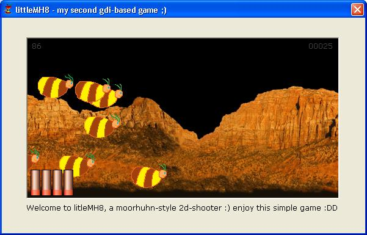



## littlemh8 \- a moorhuhn\-style 2d\-shooter using gdi :\)

### Description

this is a very simple 2d gdi-game :) it demonstrates how to create games using the BitBlt function. you have to kill all these ... hmm... don't know what they are, i'm not a designer ;) if you don't kill them, there will be many such enemys and the game will become very, very slow ;) move your mouse to move the cursor and click to kill them :)
 
### More Info
 

             |
---                |---
**Submitted On**   |2001-10-09 12:53:56
**By**             |[Pablo Hoch](https://github.com/Planet-Source-Code/PSCIndex/blob/master/ByAuthor/pablo-hoch.md)
**Level**          |Beginner
**User Rating**    |5.0 (10 globes from 2 users)
**Compatibility**  |VB 6\.0
**Category**       |[Games](https://github.com/Planet-Source-Code/PSCIndex/blob/master/ByCategory/games__1-38.md)
**World**          |[Visual Basic](https://github.com/Planet-Source-Code/PSCIndex/blob/master/ByWorld/visual-basic.md)
**Archive File**   |[littlemh8 280821092001\.zip](https://github.com/Planet-Source-Code/pablo-hoch-littlemh8-a-moorhuhn-style-2d-shooter-using-gdi__1-27935/archive/master.zip)

